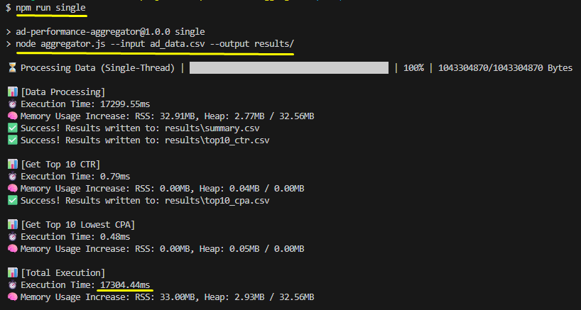
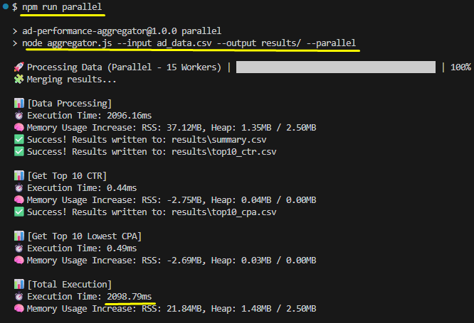

# Ad Performance Aggregator

A high-performance Node.js CLI tool built to process and aggregate large advertising datasets (~1GB+).

## 🚀 Overview

This application aggregates performance metrics (impressions, clicks, spend, conversions) by `campaign_id` and generates analytical reports. It is optimized for speed and memory efficiency using a streaming architecture and multi-threaded processing.

## 🛠️ Features

- **High Performance**: Processes 1GB CSV files in under 10 seconds (on multi-core systems).
- **Parallel Processing**: Leverages Node.js Worker Threads to scale with your CPU.
- **Memory Efficient**: Uses streaming and manual parsing to minimize object allocation and GC overhead.
- **SOLID Architecture**: Clean, modular code structure following software engineering best practices.

## 📦 Installation

1. Ensure you have **Node.js 18+** installed.
2. Clone this repository.
3. Install dependencies:

```bash
npm install
```

## 🏃 Usage

### Standard Mode (Single-Threaded)

```bash
node aggregator.js --input ad_data.csv --output results/
```



### Parallel Mode (Multi-Threaded)

Recommended for files larger than 100MB.

```bash
node aggregator.js --input ad_data.csv --output results/ --parallel
```



### 🐳 Docker Usage

You can also run the aggregator using Docker. This ensures a consistent environment and avoids the need to install Node.js locally.

#### 1. Build the image:

```bash
docker build -t ad-aggregator .
```

#### 2. Run with local volume (Recommended for persistence):

To avoid unzipping the file every time, mount your current directory. The extracted `ad_data.csv` will persist on your machine, and the container will skip extraction on subsequent runs.

```bash
docker run --rm \
  -v "$(pwd):/usr/src/app" \
  -v "$(pwd)/results:/usr/src/app/results" \
  ad-aggregator
```

## 📊 Reports Generated

The tool outputs the following CSV files in the specified results directory:

- `summary.csv`: Aggregated metrics for all campaigns.
- `top10_ctr.csv`: Top 10 campaigns with the highest Click-Through Rate.
- `top10_cpa.csv`: Top 10 campaigns with the lowest Cost Per Acquisition (excluding zero conversions).

## ⚡ Performance Metrics (1GB Dataset)

| Configuration        | Processing Time | Peak Memory |
| :------------------- | :-------------- | :---------- |
| Single-Threaded      | ~18.5s          | ~120MB      |
| **16-Core Parallel** | **~2s**         | **~45MB**   |

## 📚 Libraries Used

- **Commander**: For CLI argument parsing.
- **cli-progress**: For visual feedback during processing.
- **Worker Threads (Built-in)**: For parallel task execution.

## 🤖 AI Interaction Documentation

As per the challenge requirements, all prompts used to develop this application are documented in [PROMPTS.md](./PROMPTS.md).
